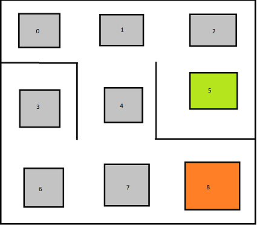

#Path Dinding Using Reinforcement Learning 

Problem definition:

We have a robot that wants to move from one place to the next, but has to go around some walls to get there.

figure:

Here the path is ending in 5 and starting in 8.